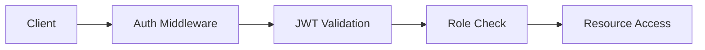

# Express Guardian 🛡️

A secure and scalable Express.js boilerplate with comprehensive monitoring and features.

## Features 🚀

### Security

- JWT based authentication with refresh tokens
- Role based authorization (RBAC)
- Rate limiting with Redis
- Helmet security headers
- CSRF protection
- Input validation with Zod
- Secure session handling

### Monitoring & Logging

- Request/Response logging
- Performance metrics
- Health check endpoint
- Error tracking
- System metrics (CPU, Memory)
- Admin logs viewer

### Development

- TypeScript support
- ESLint & Prettier
- Hot reloading
- Swagger documentation
- Automated testing with Jest
- CI/CD with GitHub Actions

## Quick Start 🏃‍♂️

### Prerequisites

```bash
# Required
Node.js (>= 18)
MongoDB
Redis

# Optional
Docker
```

### Installation

```bash
# Clone the repo
git clone https://github.com/imalican/express-guardian.git

# Install dependencies
cd express-guardian
npm install

# Setup environment variables
cp .env.example .env

# Start development server
npm run dev
```

## Documentation 📚

### API Documentation

- Swagger UI available at: `http://localhost:3000/api-docs`
- Postman collection in `requests/` directory

### Environment Variables

```env
NODE_ENV=development
PORT=3000
MONGODB_URI=mongodb://localhost:27017/express-guardian
REDIS_URL=redis://localhost:6379
JWT_SECRET=your-super-secret-key
JWT_REFRESH_SECRET=your-refresh-secret-key
```

## Roadmap 🗺️

### Coming Soon

- [ ] Email service integration
- [ ] S3/Cloud storage support
- [ ] WebSocket support
- [ ] Docker compose setup
- [ ] Admin dashboard
- [ ] OAuth2 integration

### Under Consideration

- [ ] GraphQL support
- [ ] Microservices architecture
- [ ] Kubernetes configs
- [ ] Elastic search integration

## Contributing 🤝

1. Fork the repository
2. Create your feature branch (`git checkout -b feature/amazing-feature`)
3. Run tests (`npm test`)
4. Commit your changes (`git commit -m 'feat: add amazing feature'`)
5. Push to the branch (`git push origin feature/amazing-feature`)
6. Open a Pull Request

## License 📝

This project is licensed under the MIT License - see the [LICENSE](LICENSE) file for details.

## Detailed Setup Guide 🔧

### Local Development Setup

1. **System Requirements**

```bash
# Check Node.js version
node --version  # Should be >= 18

# Check MongoDB
mongod --version

# Check Redis
redis-cli --version
```

2. **Database Setup**

```bash
# Start MongoDB
mongod --dbpath /data/db

# Start Redis
redis-server

# Verify connections
mongo mongodb://localhost:27017/express-guardian
redis-cli ping
```

3. **Application Setup**

```bash
# Install global dependencies
npm install -g typescript ts-node

# Install project dependencies
npm install

# Build the project
npm run build

# Run migrations (if any)
npm run migrate
```

## Troubleshooting Guide 🔍

### Common Issues

1. **MongoDB Connection Issues**

```bash
Error: MongoServerError: Connection refused
Solution: Ensure MongoDB is running and check MONGODB_URI in .env
```

2. **Redis Connection Issues**

```bash
Error: Redis connection failed
Solution: Verify Redis server is running and REDIS_URL is correct
```

3. **JWT Issues**

```bash
Error: Invalid token
Solution: Check JWT_SECRET in .env matches the one used to generate tokens
```

4. **Build Issues**

```bash
Error: TypeScript compilation failed
Solution: Run npm run lint to check for syntax errors
```

## Best Practices 📚

### Code Style

1. **TypeScript**

- Use strict type checking
- Avoid `any` type
- Use interfaces for object shapes
- Enable strict null checks

2. **API Design**

- Use RESTful conventions
- Version your APIs
- Use proper HTTP methods
- Implement proper error responses

3. **Security**

- Never store secrets in code
- Always validate input
- Use parameterized queries
- Implement rate limiting

4. **Testing**

- Write unit tests for services
- Write integration tests for APIs
- Mock external services
- Maintain high test coverage

## Architecture Overview 🏗️

### Project Structure

```
src/
├── features/          # Feature modules
│   ├── auth/         # Authentication
│   ├── users/        # User management
│   └── files/        # File operations
├── shared/           # Shared modules
│   ├── config/       # Configuration
│   ├── middlewares/  # Middleware
│   └── utils/        # Utilities
└── test/             # Test files
```

### Key Components

1. **Authentication Flow**



2. **Request Pipeline**

```
Request → Logger → Rate Limiter → Auth → Validation → Handler → Response
```

3. **Error Handling**

```
Try/Catch → Error Handler → Error Response
```

4. **Monitoring Flow**

```
Request → Metrics Collection → Performance Check → Logging → Alert
```

## Performance Optimization 🚀

1. **Caching Strategy**

- Redis for session storage
- Response caching
- Query result caching

2. **Database Optimization**

- Proper indexing
- Query optimization
- Connection pooling

3. **Security Measures**

- Rate limiting
- Input sanitization
- XSS protection
- CSRF tokens

## Deployment Guide 🌐

1. **Production Checklist**

- Set NODE_ENV=production
- Configure proper logging
- Setup monitoring
- Enable compression

2. **Docker Deployment**

```bash
# Build image
docker build -t express-guardian .

# Run container
docker run -p 3000:3000 express-guardian
```

3. **CI/CD Pipeline**

- GitHub Actions for testing
- Automated deployments
- Version tagging
- Release management
